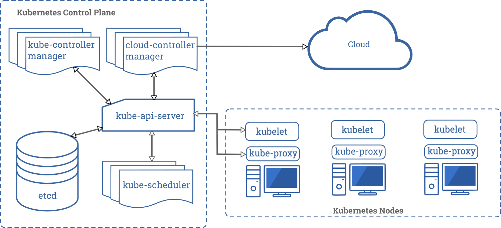

# Introduction

# Content
1. [Definitions](#definitions)
2. [NGINX](#nginx)
3. [Zabbix](#zabbix)
4. [Istio](#istio)
5. [Virtualization](#virtualization)
   1. [Docker](#docker)
      1. [Docker-compose](#docker-compose)
      2. [Docker Swarm](#docker-swarm)
         1. [Docker Swarm vs Kubernetes](#docker-swarm-vs-kubernetes)
   2. [Kubernetes](#kubernetes)
      1. [Composition](#composition)
         1. [kube-apiserver](#kube-apiserver)
         2. [etcd](#etcd)
         3. [kube-scheduler](#kube-scheduler)
         4. [kube-controller-manager](#kube-controller-manager)
         5. [cloud-controller-manager](#cloud-controller-manager)
         6. [kubelet](#kubelet)
         7. [kube-proxy](#kube-proxy)
         8. [DNS](#dns)
         9. [Dashboard](#dashboard)
         10. [Container resource monitoring](#container-resource-monitoring)
         11. [Cluster logging](#cluster-logging)
      2. [Concepts](#Concepts)
         1. [Pod](#pod)
         2. [Service](#service)
         3. [Deployment](#deployment)
         4. [StatefulSet](#statefulset)
         5. [ReplicaSet](#ReplicaSet)
      3. [Helm](#helm)
   3. [OpenShift](#openshift)
6. [Grafana](#grafana)
   1. [Clients](#clients)
      1. [Promtail](#promtail)
      2. [Fluentd](#fluentd)
   2. [Loki](#loki)
   3. [Prometheus](#prometheus)
7. [ELK-stack](#elk-stack)
   1. [Elasticsearch](#elasticsearch)
   2. [Logstash](#logstash)
   3. [Kibana](#kibana)

# Definitions
- Reverse-proxy translate requests from outer network to company inner network
- Orchestration is an automatic container deployment and managing 

# NGINX
Used as:
- Load balancer
- Web server
- Reverse proxy

# Zabbix
Tool for monitoring IT infrastructure such as networks, 
servers, virtual machines, and cloud services.

# Istio
Istion is a modernized service networking layer that provides a 
transparent and language-independent way to flexibly and easily 
automate application network functions.

[//]: # (FIXME)
# Virtualization
## Docker
Tool for simple containerization
### Docker-compose
To dockerize multiple containers in one virtual network

### Docker Swarm
It provides orchestration like kubernetes out of the box.
It's simpler then kubernetes, therefore easier to use. But it's also disadvantage
because it not so flexible and fail-safe.

#### Docker Swarm vs Kubernetes
Kubernetes is better because:
- Supports other containers (rkt, CRI-O)
- Provide more abilities because
  - Contains proxy-balancer
  - Contains etcd to store cluster state

## Kubernetes
In terms of infrastructure, kubernetes consists of
1. Master node
2. Multiple workers

### Composition
[(RU) Documentation](https://kubernetes.io/ru/docs/concepts/overview/components/)

Kubernetes control plane consists of:

#### kube-apiserver
Provide kubernetes API

#### etcd
key-value storage. Kubernetes use it to store the entire cluster state,
and as such for monitoring and managing.

#### kube-scheduler
Binds created pods to a worker.

#### kube-controller-manager
#### cloud-controller-manager

In turn workers contains
#### kubelet
Agent that controls container startup

#### kube-proxy

#### Additions
##### DNS
##### Dashboard
##### Container resource monitoring
##### Cluster logging

### Concepts
#### Pod
Smallest unit in kubernetes, contains one or more containers 
with shared storage and network resources, and a specification 
for how to run the containers.

#### Service
#### Deployment
- Runs a set of identical pods
- Monitors the state of each pod, updating as necessary

#### StatefulSet
#### ReplicaSet

### Helm
Helm is a tool to help you define, install, and upgrade applications running on Kubernetes.
## OpenShift

Advantages:
- Let control load on specified endpoints

# Grafana
## Clients
### Promtail
Promtail is an agent which ships the contents of local 
logs to a private Grafana Loki instance or Grafana Cloud. 
It is usually deployed to every machine that has applications 
needed to be monitored.

### Fluentd
Grafana Loki has a Fluentd output plugin called 
fluent-plugin-grafana-loki that enables shipping logs to 
a private Loki instance or Grafana Cloud.

## Loki
## Prometheus

# ELK-stack
## Elasticsearch
## Logstash
## Kibana