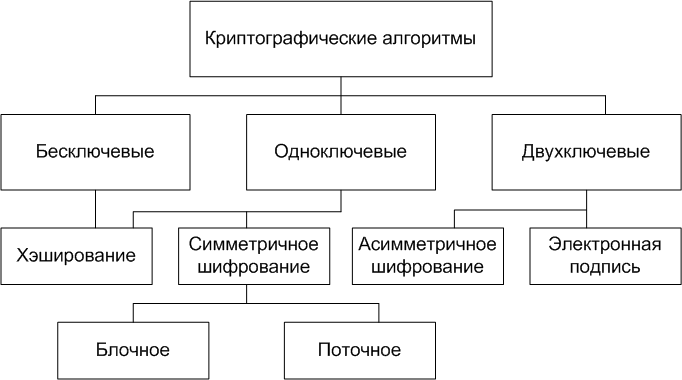

# Introduction
- ***Encryption*** is a data transformation method, available for human reading,
into unavailable for understanding form.  
- ***Decryption*** as u may guess, is a reverse operation.

## Content:
1. [Type by encryption methods](#Type-[Methods])
2. [Type by encryption strength](#Type-[Strength])
3. [The best algorithms](#best-known)

## Type [Methods]
You may use one key for encryption and decryption (it's a symmetrical encrypt), 
or a pair of keys (asymmetrical), where the first named *private* and uses for decryption, 
and the second - *public* - uses for encryption.
1. ***Symmetrical***
2. ***Asymmetrical***
3. ***Hybrid*** - asymmetrical method for symmetrical key exchange. Usually use [KEM](https://en.wikipedia.org/wiki/Key_encapsulation_mechanism) - key encapsulation mechanism for symmetric key transition.

Despite all this, symmetrical keys are still used. 
In contrast to asymmetrical algorithms, they have bigger performance.  
Frequently used hybrid encryption method. For example, SSL/TLS uses *asymmetrical on handshake stage*, 
exchanges symmetrical key and further use only them.

## Type [Strength]
There are two types:
1. Absolutely strong
2. Enough strong

## Best known
1. Asymmetrical
   1. ECSDA - Elliptic Curve Digital Signature Algorithm
   2. RSA - Rivest, Shamir и Adelman
   3. DSA - Digital Signature Algorithm
   4. ElGamal encryption
2. Symmetrical
   1. AES - Advanced Encryption Standard
   2. DES - Data Encryption Standard
   
## Used approaches
1. ***Avalanche effect*** - little changes on input lead to *avalanche* changes on output.
2. Cipher
   1. ***Block cipher*** - symmetrical cipher, which operating on fixed-length groups of bits, called blocks.
   2. ***Stream cipher*** - symmetrical cipher, which encrypts each byte (symbol) according to key and symbol place in text.

## Links
1. [RU Asymmetrical](https://encyclopedia.kaspersky.ru/glossary/asymmetric-encryption/) - [Type [Methods]](#Type-[Methods])
2. [RU Basics](https://habr.com/ru/post/449552/) - only basics, the rest of info so *weak*.
3. [RU Avalanche](https://ru.wikipedia.org/wiki/%D0%9B%D0%B0%D0%B2%D0%B8%D0%BD%D0%BD%D1%8B%D0%B9_%D1%8D%D1%84%D1%84%D0%B5%D0%BA%D1%82)
