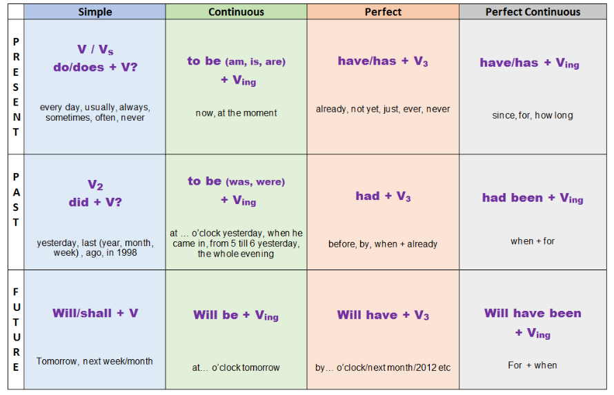
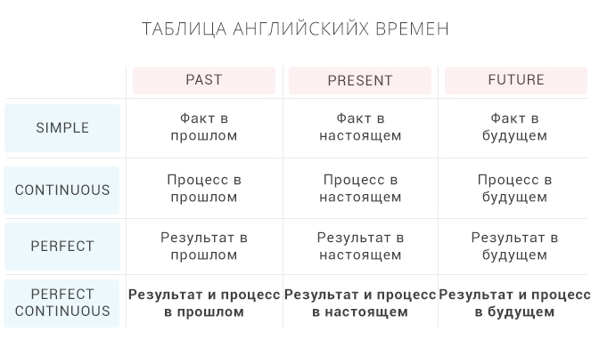
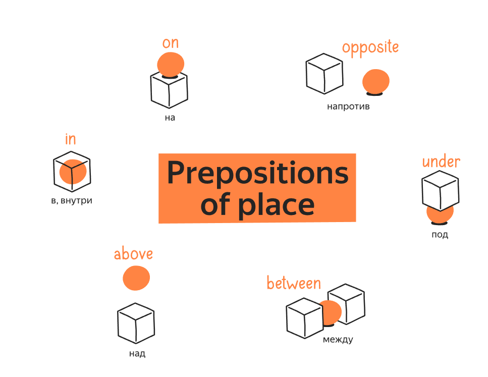
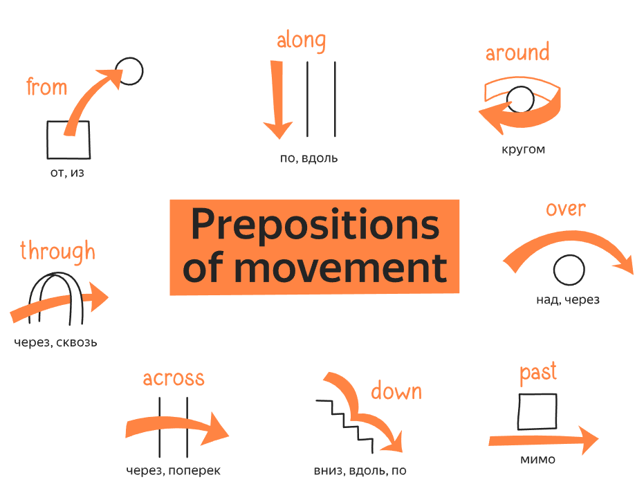
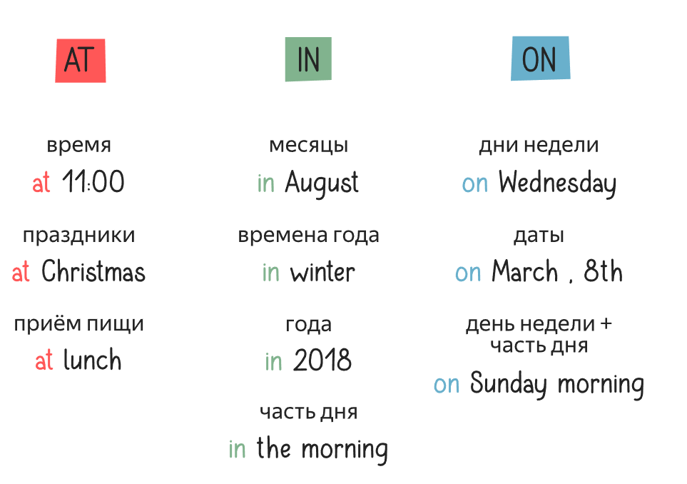

# Introduction

# Content
- Tenses
  - Simple
    - [Present Simple](#present-simple)
    - [Past Simple](#past-simple)
    - [Future Simple](#future-simple)
  - Continuous
    - [Present Continuous](#present-continuous)
    - [Past Continuous](#past-continuous)
    - [Future Continuous](#future-continuous)
  - Perfect
    - [Present Perfect](#present-perfect)
    - [Past Perfect](#past-perfect)
    - [Future Perfect](#future-perfect)
  - Perfect Continuous
    - [Present Perfect Continuous](#present-perfect-continuous)
    - [Past Perfect Continuous](#past-perfect-continuous)
    - [Future Perfect Continuous](#future-perfect-continuous)
- LSRW - General abilities
  - [Listening](#listening)
  - [Speaking](#speaking)
  - [Reading](#reading)
  - [Writing](#writing)
- English levels
  - [A1](#a1)
  - [A2](#a2)
  - [B1](#b1)
  - [B2](#b2)
  - [C1](#c1)
  - [C2](#c2)
- Other

# Tenses
[The best book ever](tenses.pdf)

He/She/It - Vs
## Present Simple
***When to use***:
- Routine (smthng u do every day)

How to build:
- V/Vs

## Past Simple
## Future Simple

## Present Continuous
When to use:
- Actions we want to show **irritation** (exmp: "You're **always** interrupting me")
- Actions planned on future
- Action happens right now

How to build:

## Past Continuous
## Future Continuous

## Present Perfect
## Past Perfect
## Future Perfect

## Present Perfect Continuous
## Past Perfect Continuous
## Future Perfect Continuous

# Listening
# Speaking
# Reading
- [enrutext](text.com/teksty/teksty-srednego-urovnya/b1-intermediate/)
# Writing

# A1
## Required knowledge
[EF SET](https://www.efset.org/ru/cefr/a1/)
# A2
# B1
# B2
# C1
# C2

# Other

