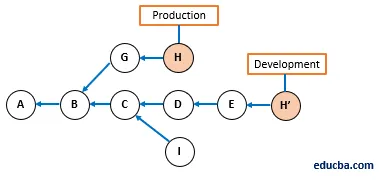

# Introduction
Git is a distributed version control system (distributed VCS).

# Content
1. [SVN](#svn)
   1. [Git VS SVN](#git-vs-svn)
2. [Concepts](#concepts)
3. [Commands](#commands)
   1. [git cherry pick](#git-cherry-pick)
   2. [git revert](#git-revert)
   3. [git merge](#git-merge)
   4. [git rebase](#git-rebase)
      1. [merge VS rebase](#git-merge-vs-git-rebase)
   5. [git stash](#git-stash)
   6. [git squash](#git-squash)

## SVN
As git, but centralized (centralized VCS).

### Git VS SVN
- GIT распределяется, а SVN - нет. Другими словами, если есть несколько разработчиков работающих с репозиторием у каждого на локальной машине будет ПОЛНАЯ копия этого репозитория. Разумеется есть и где-то и центральная машина, с которой можно клонировать репозиторий. Это напоминает SVN. Основной плюс в том, что если вдруг у вас нет доступа к интернету, сохраняется возможность работать с репозиторием. Потом только один раз сделать синхронизацию и все остальные разработчики получат поолную историю.
- GIT сохраняет метаданные изменений, а SVN целые файлы. Это экономит место и время.
- Система создания branches, versions и прочее в GIT и SVN отличаются значительно. В GIT проще переключатся с ветки на ветку, делать merge между ними. В общем GIT я нахожу немного проще и удобнее, но бывают конечно иногда сложности. Но где их не бывает?

## Concepts
- Git objects may be 4 types: blob, tree, commit, tag
  - Blob in git contains ***only*** file data (after using git add)
  - Tree in git contains references on blob files or other links and ***file info** (i.e. filename, accesses)
  - Commit in git contains changes info. More precisely, references on ancestors.
  - Just tags.
- Git uses SHA-1 for generating hash-sum.
- Commit hash contains info about author, creation date
- **Links:**
  - [(RU) Git's graph properties](https://habr.com/ru/post/313890/#:~:text=%D0%BA%D0%BE%D0%BF%D0%B8%D0%B8%20%D0%B8%20%D0%B8%D0%BD%D0%B4%D0%B5%D0%BA%D1%81%D0%B0-,%D0%A1%D0%B2%D0%BE%D0%B9%D1%81%D1%82%D0%B2%D0%B0%20%D0%B3%D1%80%D0%B0%D1%84%D0%B0%3A,-%E2%80%A2%20%D0%A1%D0%BE%D0%B4%D0%B5%D1%80%D0%B6%D0%B8%D0%BC%D0%BE%D0%B5%20%D1%85%D1%80%D0%B0%D0%BD%D0%B8%D1%82%D1%81%D1%8F%20%D0%B2)
  - [(RU) Git objects](https://www.opennet.ru/base/dev/git_guts.txt.html)
## Commands

### git cherry pick
Команда git cherry-pick берёт изменения, вносимые одним коммитом, 
и пытается повторно применить их в виде нового коммита в текущей ветке. 
Эта возможность полезна в ситуации, когда нужно забрать парочку 
коммитов из другой ветки, а не сливать ветку целиком со всеми внесенными в нее изменениями.

### git revert

### git merge

### git rebase

#### git merge VS git rebase

### git stash

- git stash apply

### git squash