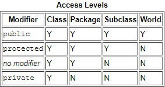

# Important themes
1. JCF
2. Вложенные классы
3. Early/lately binding
4. Многопоточка, параллелизм
5. annotations

# Content
1. [JDK](#jdk)
   1. [JEP](#jep) - JDK Enhancement Proposal
2. [JCF](#1.-Java-Collections-Framework-(JCF))
3. [Nested classes](#2.-Nested-classes)
4. [Unclassified](#Unclassified)

## JDK

### JEP
[JEP](https://en.wikipedia.org/wiki/JDK_Enhancement_Proposal) is a 
JDK Enhancement Proposal - index of JDK proposal with goal to improve it.
The list of all JEPs stored [here](https://openjdk.java.net/jeps/0)

## 1. Java Collections Framework (JCF)

## 2. Nested classes

### Types
- Static nested classes
- Non-static nested classes
- Local classes
- Anonymous classes

## Unclassified
1. [(RU)Type-casting](https://javascopes.com/java-type-casting-b529c005/#:~:text=%D0%A1%D1%81%D1%8B%D0%BB%D0%BA%D0%B0%20%D0%BF%D0%BE%D0%B4%D0%BE%D0%B1%D0%BD%D0%B0%20%D0%B4%D0%B8%D1%81%D1%82%D0%B0%D0%BD%D1%86%D0%B8%D0%BE%D0%BD%D0%BD%D0%BE%D0%BC%D1%83%20%D1%83%D0%BF%D1%80%D0%B0%D0%B2%D0%BB%D0%B5%D0%BD%D0%B8%D1%8E%20%D0%BE%D0%B1%D1%8A%D0%B5%D0%BA%D1%82%D0%BE%D0%BC.%20%D0%9F%D1%83%D0%BB%D1%8C%D1%82%20%D0%B4%D0%B8%D1%81%D1%82%D0%B0%D0%BD%D1%86%D0%B8%D0%BE%D0%BD%D0%BD%D0%BE%D0%B3%D0%BE%20%D1%83%D0%BF%D1%80%D0%B0%D0%B2%D0%BB%D0%B5%D0%BD%D0%B8%D1%8F%20%D0%B8%D0%BC%D0%B5%D0%B5%D1%82%20%D0%B1%D0%BE%D0%BB%D1%8C%D1%88%D0%B5%20%D0%B8%D0%BB%D0%B8%20%D0%BC%D0%B5%D0%BD%D1%8C%D1%88%D0%B5%20%D0%BA%D0%BD%D0%BE%D0%BF%D0%BE%D0%BA%20%D0%B2%20%D0%B7%D0%B0%D0%B2%D0%B8%D1%81%D0%B8%D0%BC%D0%BE%D1%81%D1%82%D0%B8%20%D0%BE%D1%82%20%D0%B5%D0%B3%D0%BE%20%D1%82%D0%B8%D0%BF%D0%B0%2C%20%D0%B0%20%D1%81%D0%B0%D0%BC%20%D0%BE%D0%B1%D1%8A%D0%B5%D0%BA%D1%82%20%D1%85%D1%80%D0%B0%D0%BD%D0%B8%D1%82%D1%81%D1%8F%20%D0%B2%20%D0%BA%D1%83%D1%87%D0%B5.%20%D0%9A%D0%BE%D0%B3%D0%B4%D0%B0%20%D0%BC%D1%8B%20%D0%B2%D1%8B%D0%BF%D0%BE%D0%BB%D0%BD%D1%8F%D0%B5%D0%BC%20%D0%BA%D0%B0%D1%81%D1%82%D0%B8%D0%BD%D0%B3%2C%20%D0%BC%D1%8B%20%D0%BC%D0%B5%D0%BD%D1%8F%D0%B5%D0%BC%20%D1%82%D0%B8%D0%BF%20%D0%BF%D1%83%D0%BB%D1%8C%D1%82%D0%B0%20%D0%B4%D0%B8%D1%81%D1%82%D0%B0%D0%BD%D1%86%D0%B8%D0%BE%D0%BD%D0%BD%D0%BE%D0%B3%D0%BE%20%D1%83%D0%BF%D1%80%D0%B0%D0%B2%D0%BB%D0%B5%D0%BD%D0%B8%D1%8F%2C%20%D0%BD%D0%BE%20%D0%BD%D0%B5%20%D0%BC%D0%B5%D0%BD%D1%8F%D0%B5%D0%BC%20%D1%81%D0%B0%D0%BC%20%D0%BE%D0%B1%D1%8A%D0%B5%D0%BA%D1%82.)
2. [Package-private modifier]()
   1. ***package-private*** means that other members of the same package have access to the item. Also named *no modifier*.
   2. 