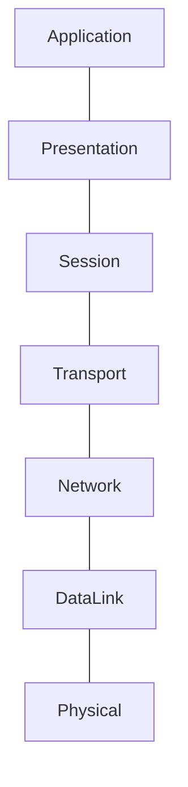
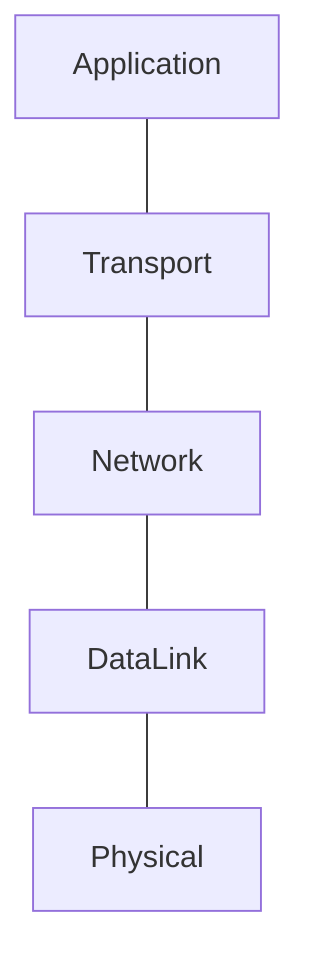

# Introduction

# Content
1. Network layer models
   1. [OSI](#osi) - Open Systems Interconnection
   2. [Five-Layer Model](#five-layer-model)
3. Protocols
   1. [SSH](#SSH) - Secure Shell protocol
   2. [SSL](#SSL) / [TLS](#TLS) - Secure Sockets Layer/Transport Layer Security
   3. [TCP](#TCP) / [IP](#IP) - Transmission Control protocol/Internet Protocol
   4. [UDP](#UDP) - User Datagram Protocol
   5. [FTP](#FTP) - File Transfer Protocol
   6. [LDAP](#LDAP) - Lightweight Directory Access Protocol
   7. [SMTP](#smtp) - Simple Mail Transfer Protocol
   8. [SNMP](#snmp) - Simple Network Management Protocol
   9. [BGP](#bgp) - Border Gateway Protocol
   10. [HTTP](#HTTP) - HyperText Transfer Protocol
       1. [Methods](#Methods)
       2. [MediaTypes](#mediaTypes)
4. Facts
   1. [WebRTC](#webrtc) - Web Real-Time Communication
   2. [Cables](#cables)
   3. [Hub&Switch](#hub--switch)
5. [Links](#Links)


## OSI


## Five-Layer model

Начнем с ***физического уровня***. Это устройства, соединяющие 
компьютеры друг с другом. К этому уровню относятся спецификации 
для сетевых кабелей и разъемов, соединяющих устройства, а также 
спецификации для передачи сигналов через эти соединения.

Выше расположен ***канальный уровень***. На этом уровне встречаются 
первые протоколы. На канальном уровне описывается общий 
способ расшифровки этих сигналов, то есть речь идет уже о 
взаимодействии устройств. Самый протокол – Ethernet, 
хотя беспроводные технологии и становятся всё более 
популярными. Стандарты Ethernet определяют не только 
атрибуты физического уровня, но и протокол, отвечающий 
за передачу данных между узлами одной и той же сети 
или канала. 

Третий уровень – ***сетевой***, иногда его также называют межсетевым. 
Сетевой уровень позволяет передавать данные в целой группе сетей. 
Когда устройство из вашей домашней сети подключается к серверу в интернете, данные 
передаются между этими двумя точками именно благодаря сетевому 
уровню. IP – основной протокол, который используется на этом уровне. 
Протокол IP лежит в основе интернета и большинства маленьких 
сетей по всему миру.

Четвертый уровень - ***транспортный***. Протоколы этого уровня создают
подключение через конкретные порты и доставляют данные к 
конкретным клиентским/серверным приложениям.

Наконец, пятый уровень – ***прикладной***. На этом уровне есть 
множество протоколов, и они связаны с разными приложениями. К примеру, HTTP
используется для веб-серверов и веб-страниц. В случае модели OSI, этот 
уровень подразделяется на уровни Сессии, Демонстрации и Приложения.

***Links:***
- [Medium](https://medium.com/@karthikayanmailsamy/5-layer-network-model-made-simplified-e813da0913ba) - about Five layer model
- [OSI](OSI.pdf) - file

## SSH
## SSL
## TLS
## TCP
TCP Port — TCP Port is used to do multiplexing and de-multiplexing operations. IANA(Internet Assigned Numbers Authority) has limited this to 16 bit value i.e 0–65536 where 1–1023 are system ports assigned to servers, 1024–49151 are registered ports assigned for special operations like database listening,etc and finally 49152–65536 are ephemeral ports assigned to client’s programs used for proper delivery of data to the applications.
## IP
## UDP
## FTP
## LDAP
## SMTP
## SNMP
To configure devices in IP-networks (i.e. routers, switches, servers, etc.)
## BGP
Used in core routers (internet provider's routers) to route traffic.
## HTTP
### Methods
1. Put - full replace data
2. Patch - partially replace data
### MediaTypes
```
type/subtype;parameter=value (i.e. application/json;charset=UTF-8)
```
1. application/octet-stream - byte array stream

## WebRTC
It's a technology that enables Web applications and sites 
to capture and optionally stream audio and/or video media, 
as well as to exchange arbitrary data between browsers without 
requiring an intermediary.
## Cables
There are 2 types:
- Copper (consists of copper twisted pairs). In this type used line coding to understand where zeros on ones.
- Fiber (consists of glass strings) - more expensive and fragile
## Hub & Switch
Hub is a device лthat allows to connect many devices to each 
other at the same time. The biggest minus is generated noises during
transfer data.
Switch is very similar to a hub, but with one difference - it's a 
data link layer device (hub is physical layer device). It's reduce 
the size of collision domains.
## Router
Is a network-layer device. They route traffic through independent networks.
# Links
1. [RU Mozilla](https://developer.mozilla.org/ru/docs/Web/HTTP/Basics_of_HTTP/MIME_types)

