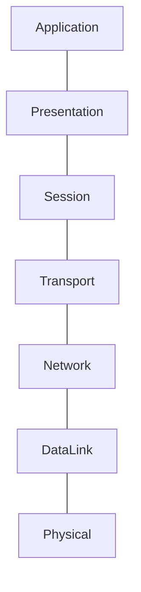
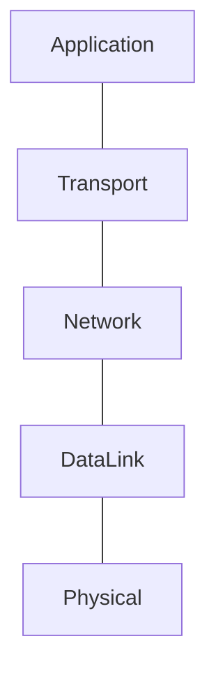
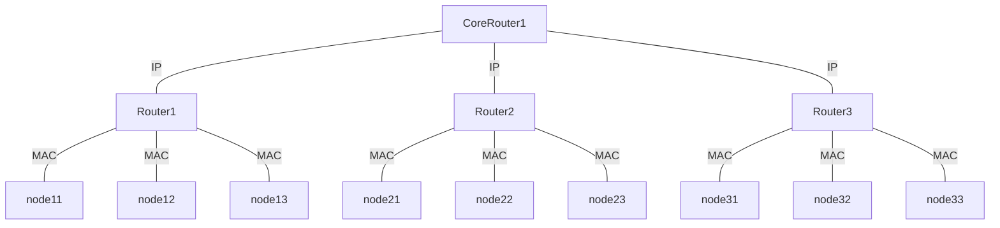

# Introduction

# Content
1. Network layer models
   1. [OSI](#osi) - Open Systems Interconnection
   2. [Five-Layer Model](#five-layer-model)
2. [MAC](#mac---media-access-control-address) - Media Access Control address
3. Protocols
   1. [Ethernet](#ethernet) (DataLink layer)
   2. [SSH](#SSH) - Secure Shell protocol
   3. [SSL](#SSL) - Secure Sockets Layer
   4. [TLS](#TLS) - Transport Layer Security
   5. [TCP](#TCP) - Transmission Control Protocol
   6. [IP](#IP) - Internet Protocol
   7. [UDP](#UDP) - User Datagram Protocol
   8. [FTP](#FTP) - File Transfer Protocol
   9. [LDAP](#LDAP) - Lightweight Directory Access Protocol
   10. [SMTP](#smtp) - Simple Mail Transfer Protocol
   11. [SNMP](#snmp) - Simple Network Management Protocol
   12. [BGP](#bgp) - Border Gateway Protocol
   13. [HTTP](#HTTP) - HyperText Transfer Protocol (Application layer)
       1. [Versions diff](#versions)
       2. [Methods](#Methods)
          1. [Idempotent](#Idempotent)
       2. [MediaTypes](#mediaTypes)
4. Facts
   1. [WebRTC](#webrtc) - Web Real-Time Communication
   2. [Network topology](#network-topology)
   3. [VLAN](#vlan) - Virtual Local Area Network
   4. [Data transmit methods](#data-transmit-methods)
5. [Links](#Links)


## OSI


### Physical
### DataLink
### Network
Routing thank to routers and MAC-addresses (diagram below).

### Transport
Operates such protocols as TCP, UDP.  

### Session layer
It manages sessions.

### Presentation layer
Transfer text between encodings (UTS-8 -> ASCII), present images and videos.

### Application layer
Operates such protocols as HTTP, FTP.

## Five-Layer model

Начнем с ***физического уровня***. Это устройства, соединяющие 
компьютеры друг с другом. К этому уровню относятся спецификации 
для сетевых кабелей и разъемов, соединяющих устройства, а также 
спецификации для передачи сигналов через эти соединения.

Выше расположен ***канальный уровень***. На этом уровне встречаются 
первые протоколы. На канальном уровне описывается общий 
способ расшифровки этих сигналов, то есть речь идет уже о 
взаимодействии устройств. Самый протокол – Ethernet, 
хотя беспроводные технологии и становятся всё более 
популярными. Стандарты Ethernet определяют не только 
атрибуты физического уровня, но и протокол, отвечающий 
за передачу данных между узлами одной и той же сети 
или канала. 

Третий уровень – ***сетевой***. 
Сетевой уровень позволяет передавать данные в целой группе сетей. 
Когда устройство из вашей домашней сети подключается к серверу в интернете, данные 
передаются между этими двумя точками именно благодаря сетевому 
уровню. IP – основной протокол, который используется на этом уровне. 
Протокол IP лежит в основе интернета и большинства маленьких 
сетей по всему миру.

Четвертый уровень - ***транспортный***. Протоколы этого уровня создают
подключение через конкретные порты и доставляют данные к 
конкретным клиентским/серверным приложениям.

Наконец, пятый уровень – ***прикладной***. На этом уровне есть 
множество протоколов, и они связаны с разными приложениями. К примеру, HTTP
используется для веб-серверов и веб-страниц. В случае модели OSI, этот 
уровень подразделяется на уровни Сессии, Демонстрации и Приложения.

***Links:***
- [Medium](https://medium.com/@karthikayanmailsamy/5-layer-network-model-made-simplified-e813da0913ba) - about Five layer model
- [OSI](OSI.pdf) - file
# MAC - Media Access Control address
MAC is a unique identifier assigned to a network interface controller 
(NIC)(i.e. network card). It also named physical address.


- CoreRouter - магистральные роутеры
- Router - роутер, объединяющий устройства в одной сети (например в одной квартире)
- Node - устройства (i.e. телефоны, ноутбуки, электрочайники).

При передаче данных IP адресата формируется из MAC-адреса устройства 
(node) и IP роутера (router).
## Ethernet
Ethernet protocol is a typical LAN technology.
Able to avoid *collision domain* thanks to CSMA/CD 
technology which let to know when cable is busy.
## SSH
## SSL

ssl более старый, tls новый
Работают на:
- пары ключей (открытый и закрытый) для шифрования/дешифрования
- сертификаты для аутентификации (mitm attack)
- HMAC для целостности данных (хэш сообщения подкладывается в конец для проверки другой стороной)
## TLS
## TCP
TCP Port — TCP Port is used to do multiplexing and de-multiplexing operations. IANA(Internet Assigned Numbers Authority) has limited this to 16 bit value i.e 0–65536 where 1–1023 are system ports assigned to servers, 1024–49151 are registered ports assigned for special operations like database listening,etc and finally 49152–65536 are ephemeral ports assigned to client’s programs used for proper delivery of data to the applications.
## IP
## UDP
## FTP
## LDAP
## SMTP
## SNMP
To configure devices in IP-networks (i.e. routers, switches, servers, etc.)

## BGP
Used in core routers (internet provider's routers) to route traffic.

## HTTP
### Versions
Http 1.1 - pipelining. E.g. multiple requests, and all responses only after the last request. 
- Advantages: less movements since u don't need to initialize multiple expensive tcp connections 
- Disadvantages: Errors during one node of pipeline (doesn't matter request or response) will affect the entire pipeline. 
---
Http 2.0: http streams. Multiple independent request in one tcp connection 
- Advantage: error in one of requests doesn't affect the rest Note: there still was a problem in TCP protocol 
related to headline blocking 
---
- Http 3.0: was introduced protocol QUIC based on UDP. The target was smartphones, which users constantly changes using 
network station. QUIC doesn't require to create a new handshake for a new network connection
### Methods
1. Put - full replace data
2. Patch - partially replace data
#### Idempotent
Idempotent - method that can be called multiple times without different outcomes.
**Advantages** consist in safe recalling without side effects.
Idempotent methods: 
- PUT 
- DELETE
- GET

Links:
- [Documentation](https://httpwg.org/specs/rfc9110.html#idempotent.methods)
- [Mozilla Docs](https://developer.mozilla.org/en-US/docs/Glossary/Idempotent)
### MediaTypes
```
type/subtype;parameter=value (i.e. application/json;charset=UTF-8)
```
1. application/octet-stream - byte array stream

### CORS
CORS - cross-origin request policy. Allows to deny request to ur web-resource from other sites. Implements using header *Access-Control-Allow-Origin*. 
If web-server configured to prevent from CORS attacks, then client (that should support CORS policy) should send header *Access-Control-Allow-Origin* 
with url of current opened site (implemented on browser level under the hood).  
When CORS is enabled, browser sends *pre-flight* OPTIONS request to check, if server accept requests from current host. If response is 200 OK, then browser sends next request with useful payload/etc.  
Links:
- [(RU) Habr](https://habr.com/en/companies/otus/articles/706908/)
- [(RU) another Habr](https://habr.com/en/companies/macloud/articles/553826/)

### CSRF
CSRF is cross-site request forgery. This attack occurs when a malicious web-site, email, blog, instant message, 
or program tricks an authenticated user's web browser into performing an unwanted action on a trusted site. If a target user is 
authenticated to the site, unprotected target sites cannot distinguish between legitimate authorized requests and forged authenticated requests.  
The most populate method to prevent these attacks is to use token, which is generated for each user request.

Links:
- [OWASP documentation](https://owasp.org/www-community/attacks/csrf)

### RMM
In context of RESTful:  
RMM stands for Richardson Maturity Model. This model introduces 4 levels of usage of REST rules in application.  
- First: only POST method
- Second: multiple basic URIs (such as /orders, /users)
- Third: multiple HTTP methods
- Fourth: HATEOAS (note: i don't think it's required) which stands for HyperText as Engine of Application State - approach when application return it's allowed to request URIs

## WebRTC
It's a technology that enables Web applications and sites 
to capture and optionally stream audio and/or video media, 
as well as to exchange arbitrary data between browsers without 
requiring an intermediary.

## Network topology
Network topology refers to the physical or logical layout of a network. 
It defines the way different nodes are placed and interconnected with each 
other. Alternately, network topology may describe how the data is transferred
between these nodes. There are two types of network topologies: 
physical and logical
- ***Physical topology*** describe real position and connections 
between network nodes.
- ***Logical topology*** describe signal direction within physical topology.
## VLAN
VLAN - Virtual Local Area Network. It is a technology that let to have multiple
logical LAN on one physical device.
## Data transmit methods
- Unicast - transmit data for *only one receiver*
- Multicast - transmit data for *group of users*
- Broadcast - transmit data for *all devices*. Broadcast MAC address is FF-FF-FF-FF-FF-FF.
# Links
1. [RU Mozilla](https://developer.mozilla.org/ru/docs/Web/HTTP/Basics_of_HTTP/MIME_types)

