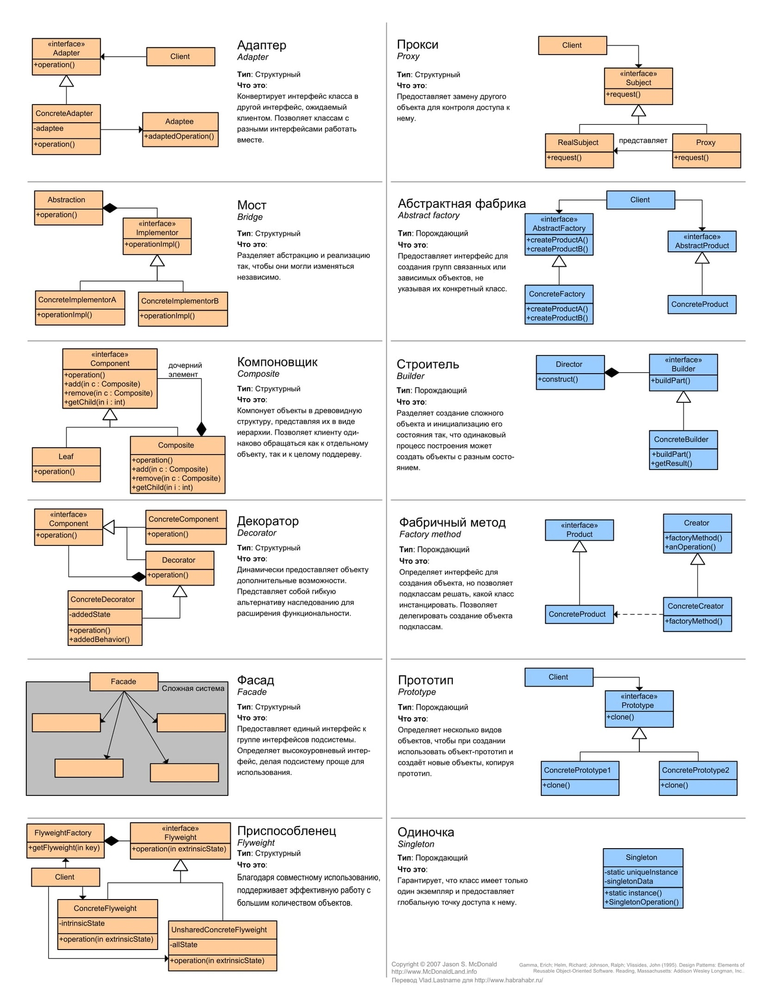
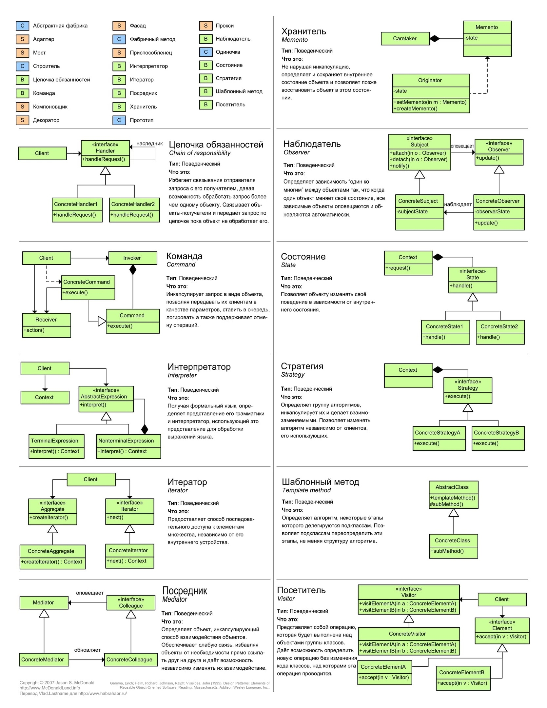
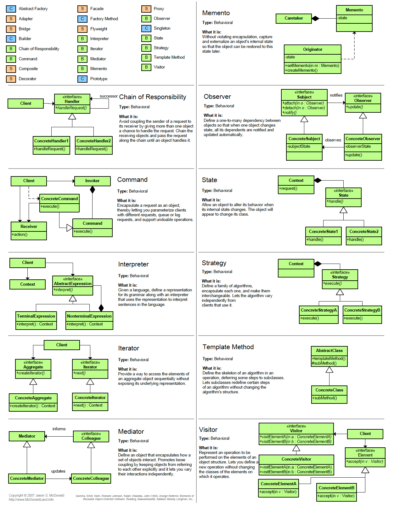
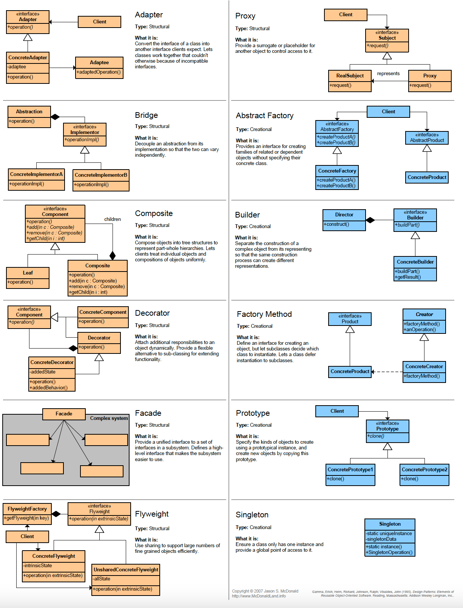

# Content
1. [DIP](#dependency-inversion-principle--dip-)
2. [IoC](#inversion-of-control--ioc-)
3. [Dependency Injection](#dependency-injection--di-)
4. [Memoization](#memoization)
5. [Regex](#regex)
6. Acronym
   1. [SOLID](#solid)
   2. [DRY](#dont-repeat-yourself) - Don't Repeat Yourself
   3. [KISS](#keep-it-simple-stupid) - Keep It Simple Stupid
   4. [YAGNI](#you-arent-gonna-need-it) - You Aren't Gonna Need It
   5. [GRASP](#grasp) - General Responsibility Assignment Software Patterns
7. [GoF](#gang-of-four) - Gang of Four
8. Patterns
   1. [Outbox](#outbox)

# Dependency Inversion Principle (DIP)
High-level modules should not depend on low-level modules. Both should depend on abstractions.
# Inversion of Control (IoC)
Inversion of Control is when library call programmer's code instead of vice versa
- [Documentation](https://docs.spring.io/spring-framework/docs/current/reference/html/core.html#spring-core)
- [StackOverflow (RU)](https://ru.stackoverflow.com/questions/499395/)
- [Book from Coursera](Spring%20IoC%20Container.pdf)
# Dependency Injection (DI)
- Allows to decouple the code

# Memoization
Variant of function result caching.
1. [(RU) Habr](https://habr.com/en/post/97513/)

# Regex
Links:
- [(RU) Tproger](https://tproger.ru/articles/java-regex-ispolzovanie-reguljarnyh-vyrazhenij-na-praktike/) - Java regex in practice

## SOLID
In software engineering, SOLID is a mnemonic acronym 
for five design principles intended to make software designs 
more understandable, flexible, and maintainable.
## Single Responsibility Principle
Каждый класс ответственен за одну задачу и инкапсулирует свою часть.
## Open-closed Principle
Класс должен быть открыт для дополнения и закрыт для изменения.
## Liskov Substitution Principle
При подстановке вместо класса-наследника класса-родителя 
поведение программы не должно изменяться.
Therefore in methods (at least in Java) we can:
- Expand access modifier
- *Narrow* return type  

What we couldn't:
- Change even order of method parameters
- Expand return type
## Interface Segregation Principle
Лучше много интерфейсов с узкой специализацией, чем один общий.
## Dependency Inversion Principle
Зависеть от абстракции, а не от реализации.
```java
class Example {
   Map<String, Object> map = new HashMap<>(); //It's good
   
   HashMap<String, Object> map = new HashMap<>(); //It's bad!
}
```
## Don't Repeat Yourself
## Keep It Simple Stupid
## You Aren't Gonna Need It

# Gang of Four
[GoF](https://refactoring.guru/ru/design-patterns) - Design Patterns: Elements of Reusable Object-Oriented Software






## Outbox
При использовании kafka сохранять сообщения перед отправкой в БД и 
по необходимости переиспользовать их.

- [(RU) Habr](https://habr.com/ru/company/lamoda/blog/678932/)