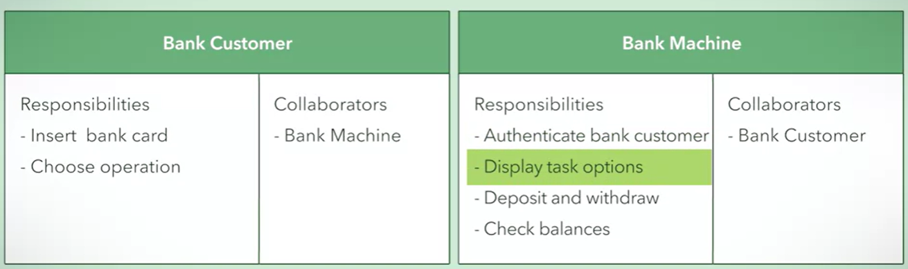

# Introduction
[(RU) Habr](https://habr.com/ru/post/459620/) - TDDx2, BDD, DDD, FDD, MDD & PDD
# Content
1. [DDD](#domain-driven-design) - Domain Driven Design
2. [TDD](#test-driven-design) - Test-Driven Design
3. [EDA](#event-driven-architecture) - Event-Driven Architecture
4. [Hexagonal architecture](#hexagonal-architecture)

# Domain Driven Design
Это про написание кода, основываясь на предметной области заказчика.
При правильном использовании позволяет максимально облегчить бизнес-логику,
уменьшить связанность классов. Стоит рассматривать, когда use-case'ов более 15.

Фишка DDD - ***bounded context***. Это явная граница, внутри которой
существует модель предметной области. Именно на основании контекстов
можно разделить код на модули/пакеты/компоненты таким образом, чтобы
изменения в каждом из них оказывали минимальное влияние на других.

***Links:***
- [(RU) Habr](https://habr.com/ru/company/dododev/blog/489352/) - basic knowledge
- [GitHub](https://github.com/heynickc/awesome-ddd) - complete resource collection
- [(RU) Habr](https://habr.com/ru/company/dododev/blog/523540/) - example
- Books:
    - [Green book.pdf](../books/VaughnVernonDDDDistilledRU.pdf)
    - [Green book eng.pdf](VaughnVernonDDDDistilledEng.pdf) - eng is better

[//]: # (FIXME)

# Test-Driven Design
Test-driven development (TDD) is a software development process relying
on software requirements being converted to test cases before software
is fully developed.

# Event-Driven Architecture

- Message broker as event bus

Advantages:
- No blocking HTTP-requests

Disadvantages:
- No immediate answers

[(RU) Habr](https://habr.com/en/post/658157/)
[(RU) Habr](https://habr.com/en/company/piter/blog/530514/)
[(RU) Habr](https://habr.com/en/company/otus/blog/492066/)

# Hexagonal architecture

## Software Design and Architecture
### Pattern Saga
For transaction management between microservices. There are two ways to manipulate transactions:
- Orchestration - there is one orchestrator which manages what transaction to start in services
- Choreography - each transaction publishes event to start transaction in another service

Implementations:
- Camunda 
- AxonIQ [cookbook](https://github.com/AxonIQ/axoniq-cookbook/blob/master/recipes/version-3.1.X/16_basic-axon-framework-application-with-spring-boot.md)

Links:
- Good explanation - [(RU) Habr](https://habr.com/en/articles/427705/)
- [(RU) Habr](https://habr.com/en/articles/744460/)
### Object-Oriented Design
Each software component divides into 3 parts:
- entities
- boundary objects ( This could be an object that deals with another software system - like an object that obtains information from the Internet)
- control objects
---
**CRC** cards are need for a basic system design, to show which components it will consist of.
Each CRC contains component name, it's responsibilities and dependency components

---
