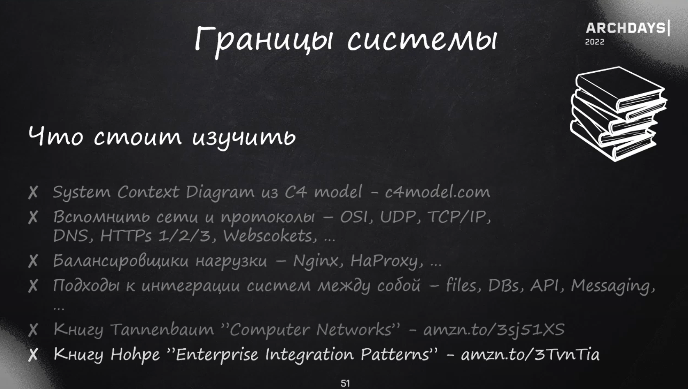
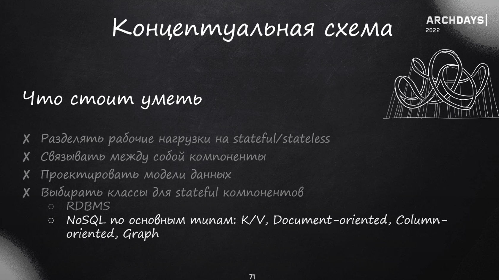
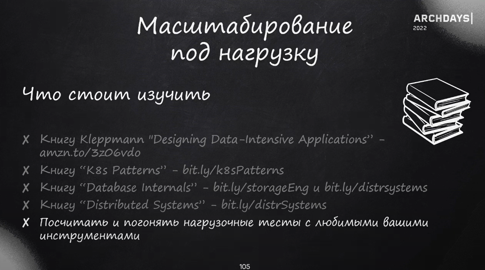

1. Нужно что-то проектировать или оно уже есть. e.g. платежный шлюз
3. В бронировании важно соблюдать консистентность
4. Расставить приоритеты

---
Как кидать ключ идемпотентности при бронировании, чтобы не было двойного списания

Очень важно спросить, что важно, а что нет при расставлении приоритетов.
Можно отбросить лишние компоненты, как платежный шлюз и т.п.

Всегда нужно искать, где и как сэкономить

Вопросы можно задать в конце:
- Сама задача, зачем задают
- Как решаются архитектурные вопросы в компании
- Странные моменты в задаче

---
- [JPoint - Владимир Маслов — System Design. Как построить распределенную систему и пройти собеседование](https://www.youtube.com/watch?v=popkBBjbAv8)  
- [ArchDays - Как подготовиться и пройти System Design Interview. Александр Поломодов](https://www.youtube.com/watch?v=jUbOm0B-eKQ)  
- [Шикарная шпора System Design 101](https://habr.com/en/articles/770564/)
- [Еще одна клевая шпора с рассчетами](https://krilovskiy.com/posts/sysdesign-cheatsheet/)

План:
1. Сбор требований
   1. Функциональные
      1. Какие упущения допустимы
   2. Нефункциональные
      1. RPS на чтение/на запись
      2. SLA/SLO/SLI
      3. Сетевой трафик, кол-во соединений
      4. DAU/MAU/WAU (daily active users)
      5. СCPU/HDD/SSD/стоимость
      6. Есть ли файлы, видео
    3. Приоритезация (что делаем в первую очередь)
2. Рассчитываем нагрузку
   1. RPS
   2. В UTF-8 для английских символов - 1 байт на символ. Кириллица - 2 байта. Максимум может быть использовано 4 байта
   3. Вес картинки в среднем 512 КБ
   4. Трафик
      1. RPS * кол-во символов * размер символа
   5. Capacity БД
      1. Трафик на запись в секунду * 86400 * 365 = увеличение БД в год
3. API
4. Модель данных
5. Верхнеуровневый дизайн: какие компоненты, будут ли БД (реляционные, k/v, etc, между какими компонентами будет взаимодействие
   1. Какие будут компоненты
   2. Какие компоненты будут между собой взаимодействовать
   3. Будут ли БД
      1. Реляционные (PostgreSQL (масштабируется шардированием))
      2. k/v
      3. Для документов (mongoDB (легко шардируется))
      4. Колоночные (clickhouse)
      5. Графовые (плохо масштабируется)
    4. Rate limiting, pagination, logging
    5. Кэширование, шардирование, репликация, consistent hashing, индексация
    6. CDN (Content Delivery Network, геораспределенный кэш статических данных)
    7. DNS
       1. Если падает API-gateway - решается DNS-балансировкой. Т.е. под одним доменным именем несколько IP-адресов
       2. С помощью GeoDNS можно привязать к одному доменному имени несколько IP-адресов. В зависимости от географического положения пользователь перенаправляется на ближайший сервер.
    8. Очередь с отложенной согласованностью - это про SAGA и распределенные транзакции (Camunda)
6. Конкретика в дизайне
   1. Какие именно методы взаимодействия компонентов
   2. Какие БД
   3. Веб-сокеты или long polling
   4. [Latency Numbers Every Programmer Should Know](https://gist.github.com/jboner/2841832)
   5. Важно помнить:
      1. 50% CPU - уже сильно больше половины
      2. Обычно доступно только 85% дискового пространства
      3. Умножать число дисков на фактор репликации
   6. RAID-массиивы
7. Bottleneck и возможные решения  

БД:
- immediate consistency - синхронная реплика. Когда консистентность данных не нарушается вообще
- eventual consistency - асинхронная реплика. Когда консистентность данных нарушается, но в конечном итоге восстанавливается
Реляционные:

|                    | PostgreSQL                                                | MySQL                                   |
|--------------------|-----------------------------------------------------------|-----------------------------------------|
| ACID               | Из коробки                                                | При использовании InnoDB и NDB Cluster  |
| XML                | Из коробки                                                | Отсутствует (или при помощи расширений) |
| Мат. вьюхи         | Из коробки                                                | Отсутствует                             |
| Хранимые процедуры | Есть возможность использовать реализации на других языках | Только на SQL                           |
| Триггер Instead of | Из коробки                                                | Отсутствует                             |
+Greenplum - массивно-параллельная обработка, в отличие от PG, OLAP.

Для документов:

|                  | MongoDB     | Amazon S3               |
|------------------|-------------|-------------------------|
| Платный          | Нет         | Да                      |
| Масштабируемость | Шардируется | Реализовано под капотом |

Key-value:

|                     | Redis                                      | Memcached                                      |
|---------------------|--------------------------------------------|------------------------------------------------|
| Масштабируемость    | Redis cluster на основе consistent hashing | Да                                             |
| Отказоустойчивость  | Есть бэкапы                                | Нет гарантии сохранения данных при перезапуске |
| Редис на минималках | Нет                                        | Да                                             |
+FIXME добавить про consistent hashing

Очереди сообщений:

|                                            | Apache Kafka            | RabbitMQ                                 |
|--------------------------------------------|-------------------------|------------------------------------------|
| Масштабируемость                           | Да, легко               | Да, сложнее                              |
| Архитектурный подход                       | Клиенты сами обращаются | Брокер самостоятельно уведомлят клиентов |
| Хранение сообщений                         | Позволяет настраивать   | Сразу удаляет                            |
| Более упрощенный и, за счет этого, быстрый | Нет                     | Да                                       |
