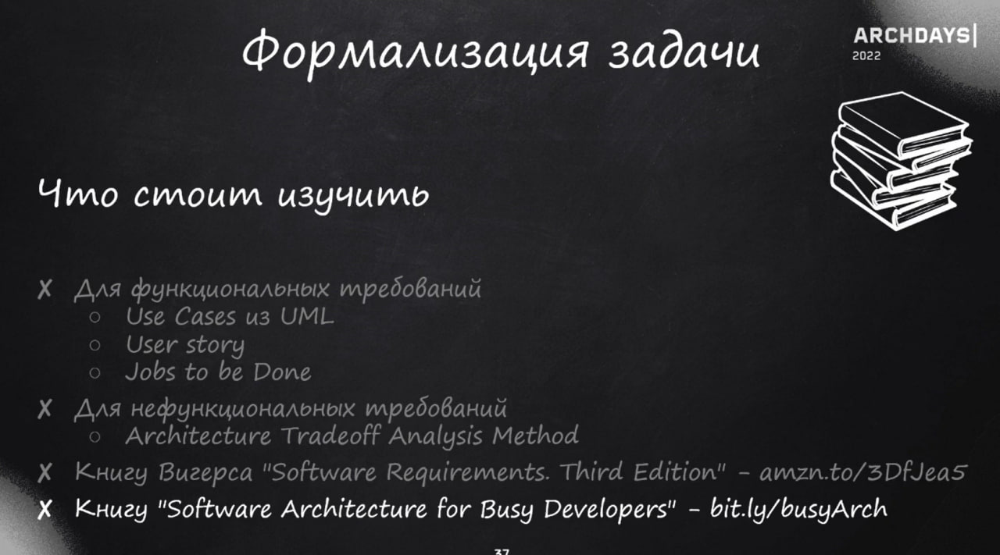

1. Нужно что-то проектировать или оно уже есть. e.g. платежный шлюз
3. В бронировании важно соблюдать консистентность
4. Расставить приоритеты

---
Как кидать ключ идемпотентности при бронировании, чтобы не было двойного списания

Очень важно спросить, что важно, а что нет при расставлении приоритетов.
Можно отбросить лишние компоненты, как платежный шлюз и т.п.

Вопросы можно задать в конце:
- Сама задача, зачем задают
- Как решаются архитектурные вопросы в компании
- Странные моменты в задаче