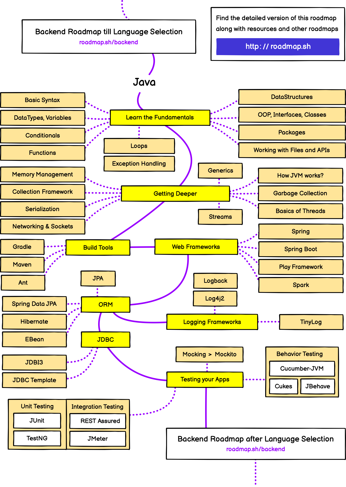

# Introduction

# Content
1. [Roadmap](#roadmap)
2. [Inner structure](#inner-structure)
   1. [JDK](#jdk)
      1. [JEP](#jep) - JDK Enhancement Proposal
3. Naming conventions
   1. [Generics](#generics)

# Roadmap

# Inner structure
## JDK
### JEP
[JEP](https://en.wikipedia.org/wiki/JDK_Enhancement_Proposal) is a 
JDK Enhancement Proposal - index of JDK proposal with goal to improve it.
The list of all JEPs stored [here](https://openjdk.java.net/jeps/0)

# Generics
- E − Element, and is mainly used by Java Collections framework.
- K − Key, and is mainly used to represent parameter type of key of a map.
- V − Value, and is mainly used to represent parameter type of value of a map.
- N − Number, and is mainly used to represent numbers.
- T − Type, and is mainly used to represent first generic type parameter.
- S − Type, and is mainly used to represent second generic type parameter.
- U − Type, and is mainly used to represent third generic type parameter.
- V − Type, and is mainly used to represent fourth generic type parameter.
- 