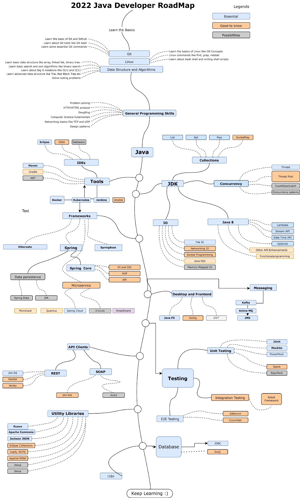
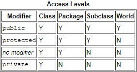

# Important themes
1. JCF
2. Вложенные классы
3. Early/lately binding
4. Многопоточка, параллелизм
5. annotations

# Content
1. [Roadmap](#roadmap)
2. [Inner structure](#inner-structure)
   1. [JDK](#jdk)
      1. [JEP](#jep) - JDK Enhancement Proposal
3. [Binding](#binding)
   1. [Early](#early-binding)
   2. [Late](#late-binding)
4. [Nested classes](#Nested-classes)
5. [Unclassified](#Unclassified)

## Roadmap

## Inner structure
### JDK
#### JEP
[JEP](https://en.wikipedia.org/wiki/JDK_Enhancement_Proposal) is a 
JDK Enhancement Proposal - index of JDK proposal with goal to improve it.
The list of all JEPs stored [here](https://openjdk.java.net/jeps/0)

## Binding
Binding is a bind between reference and code. More precisely, between:
- Method usage and method definition
- Variable usage and variable definition

There are 2 types of binding - *late* and *early*.
### Early binding
Happens during ***compile***.
In early binding happens below:
- Chose static method usage
- Chose final method usage
- Chose overloading method usage

Due to this type of binding happens during compile time, it's faster.
### Late binding
Happens during ***execution***.
On this stage happens next events:
- Chose polymorphic method usage
## Nested classes
There are 4 types of nested classes:
- Static nested classes
- Non-static nested classes
- Local classes
- Anonymous classes

## Unclassified
1. [(RU) Type-casting](https://javascopes.com/java-type-casting-b529c005/#:~:text=%D0%BC%D0%BE%D0%B6%D0%B5%D1%82%20%D1%80%D0%B0%D1%81%D1%88%D0%B8%D1%80%D0%B8%D1%82%D1%8C%20%D0%B5%D0%B3%D0%BE.-,%D0%A1%D1%81%D1%8B%D0%BB%D0%BA%D0%B0,-%D0%BF%D0%BE%D0%B4%D0%BE%D0%B1%D0%BD%D0%B0%20%D0%B4%D0%B8%D1%81%D1%82%D0%B0%D0%BD%D1%86%D0%B8%D0%BE%D0%BD%D0%BD%D0%BE%D0%BC%D1%83%20%D1%83%D0%BF%D1%80%D0%B0%D0%B2%D0%BB%D0%B5%D0%BD%D0%B8%D1%8E)
2. [Package-private modifier]()
   1. ***package-private*** means that other members of the same package have access to the item. Also named *no modifier*.
   2. 