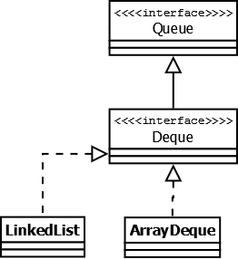

# Introduction
JCF - Java Collections Framework

# Content
- [Collection](#collection)
  - [Big O Notation](#big-o-notation)
  - [List](#list)
    - [ArrayList](#arraylist)
    - [LinkedList](#linkedlist)
    - [Vector](#vector)
    - [Stack](#stack)
    - [CopyOnWriteArrayList](#copyonwritearraylist)
  - [Set](#set)
    - [HashSet](#hashset)
    - [LinkedHashSet](#linkedhashset)
    - [SortedSet](#sortedset)
    - [NavigableSet](#navigableset)
    - [TreeSet](#treeset)
  - [Queue](#queue)
    - [Deque](#deque)
    - [ArrayDeque](#arraydeque)
    - [LinkedList](#linked-list)
- [Map](#map)
  - [HashMap](#hashmap)
  - [Hashtable](#hashtable)
  - [LinkedHashMap](#LinkedHashMap)
  - [WeakHashMap](#weakhashmap)
  - [SortedMap](#sortedmap)
  - [NavigableMap](#navigablemap)
  - [TreeMap](#treemap)

# Collection

## Big O Notation
ig O describes the set of all algorithms that run no worse than a 
certain speed (it's an upper bound) - [Baeldung](https://www.baeldung.com/java-algorithm-complexity#:~:text=Big%20O%20describes%20the%20set,certain%20speed%20(it's%20like%20equality))  
***Time complexity of JCF***


## List

### ArrayList
- Resizeable array
- Is not synchronized
### LinkedList
- implements Deque
- Contains fields Node<E> first/last
- By default, adds as last
- In turn inner class Node contains links to *next* and *previous* nodes
### Vector
- Like ArrayList
- Synchronized
- Better to use [ArrayList](#arraylist)  

It's a legacy, because it synchronizes on each individual operation. 
That's almost never what you want to do. We prefer to sync a whole 
sequence of operations. - [StackOverflow](https://stackoverflow.com/questions/1386275/why-is-java-vector-and-stack-class-considered-obsolete-or-deprecated)
### Stack
- Legacy
- Synchronized
- Better to  use Deque/ArrayDeque
### CopyOnWriteArrayList
- package java.util.concurrent
## Set

### HashSet
***Reuses HashMap for data storage***  
Since HashMap stores 2 objects, the value u add in Set adds to HashMap ***Key***. 
As ***Value*** HashSet always add Object PRESENT (dummy value - doc). It is necessarily to return true when
call HashSet.remove() - [StackOverflow](https://stackoverflow.com/questions/12829163/null-object-in-hashset-implementation)  
For the rest there is no interesting in this realization.
### SortedSet
A Set that further provides a total ordering on its elements.
### NavigableSet
A SortedSet extended with navigation methods reporting closest matches for given search targets.
### TreeSet
***Reuses TreeMap for data storage***
Also have dummy value PRESENT of type Object.
### LinkedHashSet
***Reuses LinkedHashMap for data storage***
## Queue
- LIFO - last in first out (Deque)
- FIFO - first in first out (Queue)

### Deque
### ArrayDeque
### Linked List
See [LinkedList](#linkedlist) in paragraph about Lists.
# Map
interface Entry = inner class Node<K,V>. 

## HashMap
- class Node implements Map.Entry
- Ass data storage using array of entries.
- What happens during call HashMap#put():  
Computing hash of key, computing index using formula below. The computed 
entries item names ***bucket***. If he is empty, value passes to first node. 
If key1.equals(currentKey) is false then new node links with previous, so we obtain LinkedList.
Else if ke1.equals(currentKey) is true then we update value of founded node.
```
index = hashCode(key) & (n-1)
```
- What happens during call HashMap#get():
Computing hash of key, computing index. After we sort through nodes in bucket 
till founded key wasn't equals to passed, or the bucket's nodes are run out. 
- If ***collision*** count > TREEIFY_THRESHOLD (constant, equals to 8), linked list in bucket 
will be transfer to red-black tree
- [(RU) Habr](https://habr.com/ru/post/421179/)
## Hashtable
- ***Legacy***
- Synchronized
- Like HashMap
- Better to use [HashMap](#hashmap)
## LinkedHashMap
- Store objects in adding order
- inner class Entry extends HashMap.Node, supplementing it's functionality 
with two additional fields - Entry<K,V> before/after - links for deque
- Generally like HashMap (as excepted), but thanks to 
additional fields (head/tail and before/after) we obtain functionality of Deque.
- [(RU) Habr](https://habr.com/ru/post/129037/)
## WeakHashMap
- extends HashMap
- Realized using WeakReference wrap. It means GC will delete collection item,
if there is no strong reference on it's key 
## SortedMap
- Adds firstKey()/lastKey(), subMap(K fromKey, K toKey) and headMap(K toKey)/tailMap(K fromKey)
- **headMap(K toKey)** - Returns a view of the portion of this map whose keys are strictly less than toKey.
- **tailMap(K fromKey)** - Returns a view of the portion of this map whose keys are greater than or equal to fromKey.
- Overrides entrySet(), keySet(), values() due to different Javadoc (add ordering) - [StackOverflow](https://stackoverflow.com/questions/28060736/why-java-6-overrides-keyset-entryset-and-values-interface-in-sortedmap)
## NavigableMap
It's a SortedMap extended with navigation methods returning the closest 
matches for given search targets(i.e. lowerEntry, floorEntry, ceilingEntry, and higherEntry).
## TreeMap
- Based on red-black tree (a bit about RB trees - [Own notes](https://github.com/Regyl/KnowledgeDB/tree/master/programming/data-structure#red-black-tree), [(RU) Habr](https://habr.com/ru/post/66926/))
- The map is ordered according to the natural ordering of its keys, 
or by a Comparator typically provided at creation time.