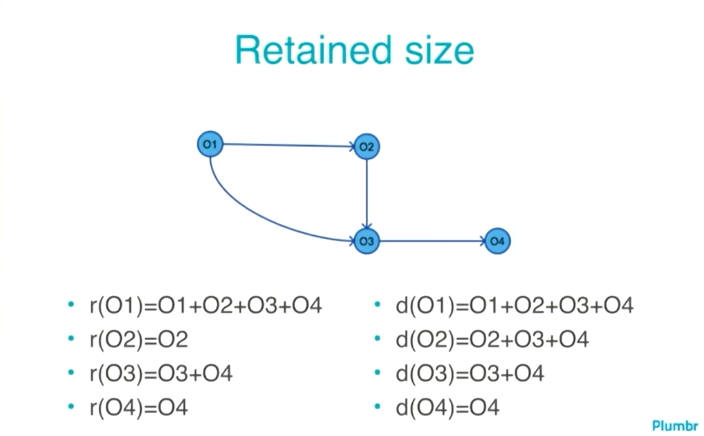

# Introduction
GC (Garbage Collector) - 

# Content
1. [Serial GC](#serial-garbage-collector)
2. [Parallel GC](#parallel-garbage-collector)
3. [CMS](#cms-garbage-collector)
4. [G1](#g1-garbage-collector)
5. [ZGC](#z-garbage-collector)
6. [Shenandoah GC](#shenandoah-garbage-collector)

## Serial Garbage Collector
## Parallel Garbage Collector
## CMS Garbage Collector
## G1 Garbage Collector
## Z Garbage Collector
## Shenandoah Garbage Collector
- [(RU) Habr](https://habr.com/ru/post/681256/)

HashSet is so expensive in point of memory usage: x13
ExecutorService has try/catch for Throwable (i.e. even for OutOfMemory and so on)
Always enable GC logs in production
Always enable HeapDumpOnOutOfMemoryError
Retained size - size which will be free if we delete this object
Shallow size - memory for exact object with it headers and fields
Finilizeable objects is bad (e.g. InputStream, Deflater) (in this case there is no GC roots)
[JPoint 2015 - Where is my memory dude](https://youtu.be/3UP0o2gkeRQ)
