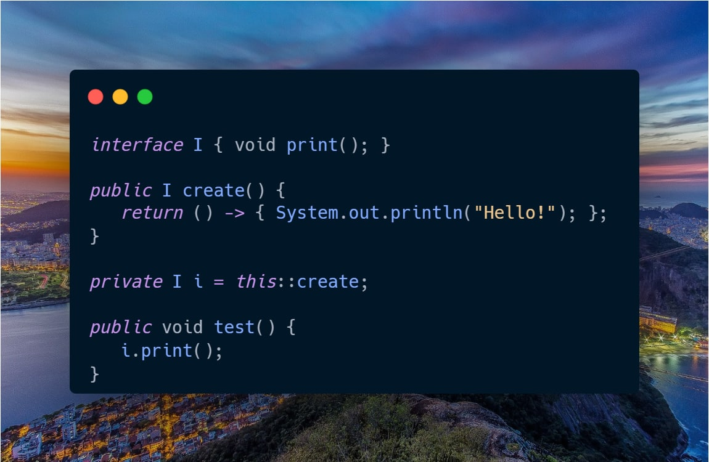

В данном случае сначала присваивается k, а уже после увеличивается на 1.

---
Попытка изменить list в процессе итерации

---
**Вопрос:** Что произойдет в случае вызова метода test()  
**Ответ:** Ничего не будет напечатано  
**Пояснение:** Несмотря на то, что метод create() возвращает значение, а метод в интерфейсе — void, всё равно можно использовать его как реализацию интерфейса I. Но во время вызова метода print() будет вызван сам метод create(), который создаст новую лямбду и вернёт её. Сама лямбда уже нигде не вызывается, значит и в консоль ничего выведено не будет.

---