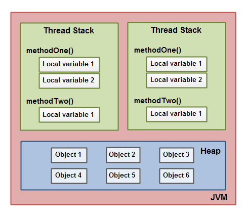
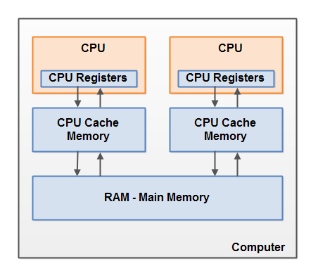

# Introduction

# Content
    
Basically JVM's memory divided into 2 types of memory:
- Thread stack (stores primitive types such as int, char, and pointers to heap)
- Heap (stores all objects)  

Generally PC's memory looks like this:  

And JVM's memory object can be everywhere in A PC:

And exactly here we firstly need _volatile_, _synchronized_, etc. Cause object can be in a CPU register/cache
and second one will not see changes that did first (till first will drop changes to RAM)

- [Paper](https://jenkov.com/tutorials/java-concurrency/java-memory-model.html)
- [(RU) Habr](https://habr.com/en/articles/510454/)