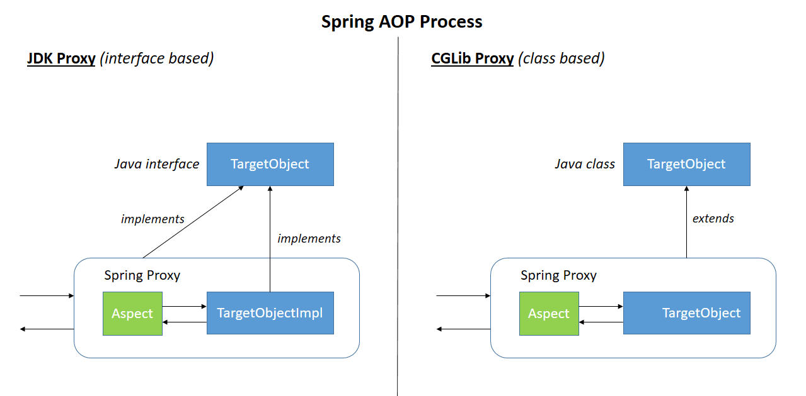

# Introduction

# Content

## Proxy
Instead of instantiation the real bean, Spring creates proxy-bean.
It's a bean consists of 2 parts: the original class methods and wrap around 'em
with additional functionality (e.g. @Transactional).

There are two ways to create a proxy with Spring:
- Interface-based (supported by JDK dynamic proxy)
- Class-bases (CGLib)

## Links:
- [Habr (RU)](https://habr.com/en/post/597797/)