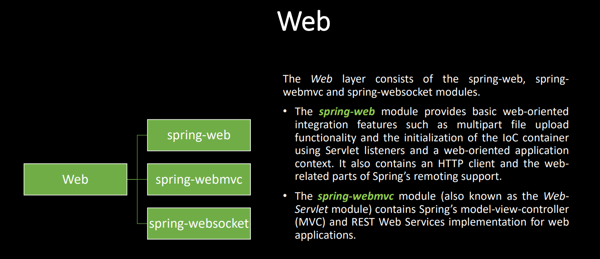

# Introduction

# Content
1. [spring-web]
2. [spring-webmvc]
3. [spring-websocket]
4. [Other]
   1. File download/upload

# Other
- [Example](https://github.com/marcobehlerjetbrains/photoz-clone/blob/main/src/main/java/com/jetbrains/marco/photoz/clone/web/DownloadController.java)