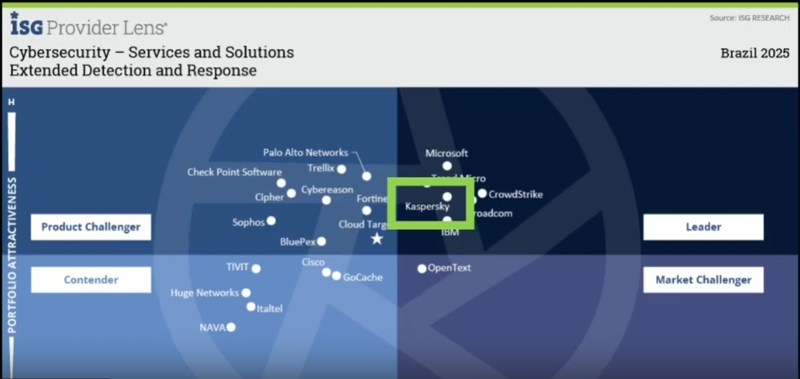

IBM Qradar SOAR:
Плейбуки на питоне

Kaspersky XDR:
Kaskpersky XDR построен на их SIEM + EDR
Есть журнал трудозатрат
Есть возможность подгружать файлы к инциденту, полученные в процессе расследования, чтобы шерить между сотрудникам
Плейбуки:
Пишутся на языке JQ
Есть возможность отправить уведомление на почту и получить аппрув от аналитика на какое-либо действие
Есть возможность задать SLA

Что такое Kaspersky MDR, Kaspersky EDR песочника

