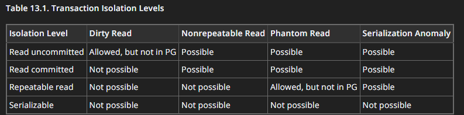

# Introduction

# Content
1. [Transactions](#Transactions)
   1. [Phenomena](#Phenomena)
2. [Scan types]()
3. [Join types](#join-types)
   1. [Nested loop](#nested-loop)
   2. [Merge join](#merge-join)
   3. [Hash join](#hash-join)
4. [Indexes](#Indexes)
   1. [Index creation](#index-creation)
   2. [B-Tree](#b-tree)
   3. [Hash](#hash)
   4. [GiST](#gist)
   5. [SP-GiST](#sp-gist)
   6. [BRIN](#brin)
   7. [Multicolumn](#multicolumn-indexes)
   8. [Indexes & Order by](#indexes-and-order-by)
   9. [Index-only scan](#index-only-scan)
5. [The Cumulative Statistics System](#the-cumulative-statistics-system)
   1. [pg_stat_database](#pgstatdatabase)

# Transactions
Transaction levels:
- Read uncommitted
- Read committed (default, sees data that exists before transaction start)
- Repeatable read (differs from read committed sees snapshot as of the start of the first non-transaction-control statement in the transaction )
- Serializable (exactly like repeatable read, but also checks that concurrency execution will produce the same resul as sequential)

Links:
- [Documentation](https://www.postgresql.org/docs/current/transaction-iso.html)
- [(RU) Habr](https://habr.com/en/post/317884/)
## Phenomena
**Dirty read**  
A transaction reads data written
by a concurrent uncommitted transaction.

**Non-repeatable read**  
A transaction re-reads data it has previously
read and finds that data has been modified by another
transaction (that committed since the initial read).

**Phantom read**  
A transaction re-executes a query returning a set of rows
that satisfy a search condition and finds that the set of rows
satisfying the condition has changed due to another recently-committed
transaction.

**Serialization anomaly**  
The result of successfully committing a group of transactions
is inconsistent with all possible orderings of running those
transactions one at a time.


# Scan types
[Source](https://arctype.com/blog/postgres-explain-analyze-scan/)
## Sequential scan

## Index scan

## Index only scan

## Bitmap Heap Scan & Bitmap Index Scan

## Bitmap And & Bitmap Or

## Parallel Scans

# Join types
[Postgres documentation](https://www.postgresql.org/docs/current/planner-optimizer.html)  
[(RU) Habr comparison](https://habr.com/ru/articles/657331/)  

## Nested loop
- Applicable: the right relation is so small
- How it works: the right relation is scanned once for every row found in the left relation

## Merge join
- Applicable: when both relations contains so many elements
- How it works: each relation is sorted on the join attributes before the join starts (sometimes postgres add force sort step)

## Hash join
- Applicable: the left relation is so small
- How it works: the right relation is first scanned and loaded into a hash table, using its join attributes as hash keys. 
Next the left relation is scanned and the appropriate values of every row found are used as hash keys to locate the 
matching rows in the table.


# Indexes
> Indexes are more useful when only a few rows need be fetched.
- [Documentation](https://www.postgresql.org/docs/current/indexes.html)
- [Documentation but more technically](https://git.postgresql.org/gitweb/?p=postgresql.git;a=tree;f=src/backend/access;hb=HEAD)
- [(RU) Habr](https://habr.com/en/company/postgrespro/blog/326096/)

## Index creation
Using parameter **concurrently** in postgres allows to 
create index by non-blocking method for writing queries.
```sql
create index concurrently order_date_btree on order_entity using btree (order_date);
```

## B-Tree
B-trees can handle equality and range queries on data that can 
be sorted into some ordering. 
In particular, the PostgreSQL **query planner will consider** 
using a B-tree index whenever 
an indexed column is involved in a comparison using one of 
these operators:
- <
- <=
- =
- \>= 
- \>

## Hash
Hash indexes store a 32-bit hash code derived from the value of 
the indexed column. Hence, such indexes can only handle simple 
equality comparisons.   
**The query** planner will consider using a hash 
index whenever an indexed column is involved in a comparison using
***the equal operator - =***

## GiST
GiST - generalized search tree  
Like [B-Tree](#b-tree), but using custom comparator to compare specific data, e.g. images, geo-data, text.
> Generalized means that the index does not know which operation it accelerates.

## SP-GiST
[SP-GiST](https://www.postgresql.org/docs/current/spgist-intro.html) - space partitioning generalized search tree
The challenge addressed by SP-GiST is to map search tree nodes to disk pages in such a way that a search 
need access only a few disk pages, even if it traverses many nodes.
> As I understood, the same GiST but with less disk calls

## GIN
[GIN](https://git.postgresql.org/gitweb/?p=postgresql.git;a=blob;f=src/backend/access/gin/README;hb=HEAD) - generalized inverted index.  
- Used for record field that contains multiple fields (such as arrays). Creates entry for each field entry. 
- A GIN index contains a metapage, a btree of key entries.  
- The primary goal of Gin indices is support for highly scalable, full-text search in PostgreSQL.

## BRIN
[BRIN](https://pganalyze.com/blog/5mins-postgres-BRIN-index) - block range index  
The way that BRIN works is that it stores the minimum and maximum value of the indexed column for each block range.
A BRIN index is always going to be fuzzy, it's not going to give you an exact row, like a B-tree index does, but it 
is very small, and that has a lot of benefits in terms of caching behavior and such.

## Multicolumn indexes
A multicolumn B-tree index can be used with query conditions that involve any subset of the index's columns, but 
the index is most efficient when there are constraints on the leading (leftmost) columns.  
[Very interesting documentation](https://www.postgresql.org/docs/15/indexes-multicolumn.html)

## Indexes and ORDER BY
Applicable only for B-Tree indexes.  
For a query that requires scanning a large fraction of the table, an explicit sort is likely to be faster than using 
an index because it requires less disk I/O due to following a sequential access pattern.

## Multiple indexes
It's a feature of Postgres - combine multiple indexes.
Postgres generate *bitmap* based on required indexes and then visited in physical order and returned.  
Since each additional index required extra time/space, planner can choose sequence scan

## Index-only scan
Since index stored separately from table data, usually during execution u need to dive into index and table data both, 
which causes extra time.  
To avoid u can create index like create index person on (last_name) include (first_name, birth_date);  
And then select like select first_name, birth_date from person where last_name = 'X';  
Include used ONLY for trailing columns whose don't appear in where clause.

## Operator classes
Just like custom comparator in GiST indexes  
***Very*** good example is https://atlasgo.io/guides/postgres/index-operator-classes

## Collate
When u need to use ordering/comparison on text/varchar/etc data types and need ***exactly*** 
stable result (each time same sequence)  
***Very*** good explanation/example: [COLLATE](https://simply.name/ru/pg-lc-collate.html)

## The Cumulative Statistics System
- [Documentation](https://www.postgresql.org/docs/current/monitoring-stats.html)
### pg_stat_database
- [Documentation](https://www.postgresql.org/docs/current/monitoring-stats.html#PG-STAT-DATABASE-VIEW)
- [Deep dive into postgres stats](https://dataegret.com/2017/03/deep-dive-into-postgres-stats-pg_stat_database/)

## Linked themes
1. [Docker](https://github.com/Regyl/KnowledgeDB/tree/master/virtual/docker)
