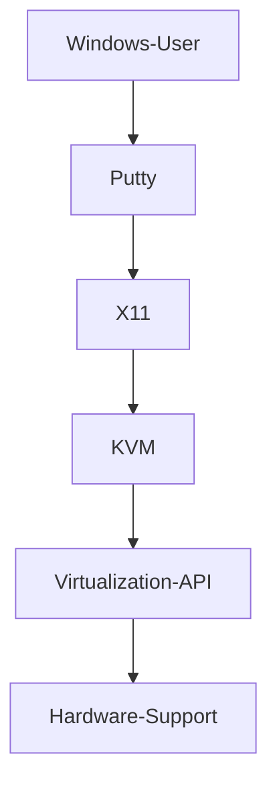

# Introduction

# Content
1. [Virtualization](#virtualization)
   1. [KVM](#kvm)
      1. [Backup](#backup)
2. [File system](#file-system)

## Virtualization
### KVM
***KVM*** - linux-based virtualization module. Provide resources (CPU, RAM, GPU, scheduler, etc.) for guest.
- *Guests* - is a virtual OS, worked on a virtualization module. 
- [(RU) KVM principals](https://habr.com/en/post/466549/)

***Structure***

***Requires***
1. Hardware-support
2. Virtualization API (i.e. [libvirt](https://libvirt.org/))
3. I/O-support (i.e. [QEMU](https://habr.com/en/post/466549/))

***See also***
- [virt-manager](https://github.com/virt-manager/virt-manager) - desktop user interface for managing virtual machines through libvirt. It primarily targets KVM VM.
- [X11-forwarding](https://www.businessnewsdaily.com/11035-how-to-use-x11-forwarding.html#:~:text=X11%20forwarding%20is%20a%20mechanism,to%20your%20local%20Windows%20machine.) - run remote graphical applications for Windows.
- [(RU) Backup principles](https://docs.ispsystem.ru/vmmanager-kvm/rezervnoe-kopirovanie/printsipy-rezervnogo-kopirovaniya)

### Backup:
1. [Link 1](https://schh.medium.com/backup-and-restore-kvm-vms-21c049e707c1)
2. [Ready script](https://nixlab.org/blog/backup-kvm-virtual-machines)

## File system
- inode - The inode (index node) is a data structure in a Unix-style file system that describes a file-system object such as a file or a directory.