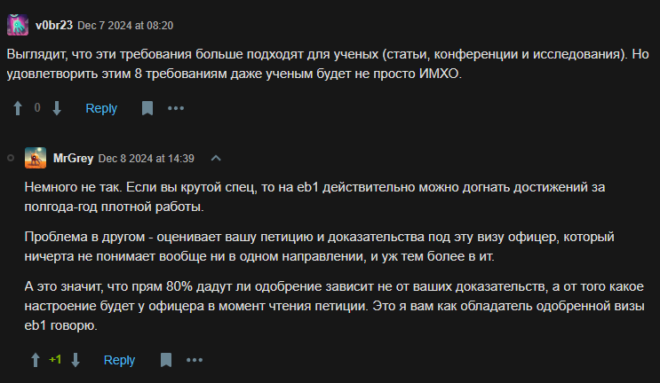
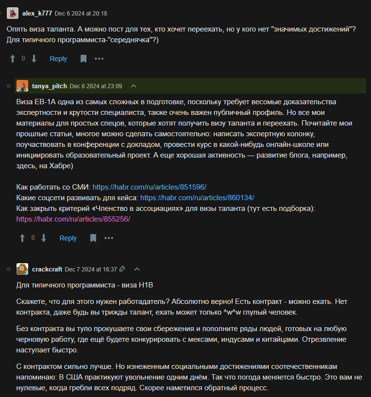

# Areas
1. Employment-based (EB-***X***) (STEM - science, tech, engineering, math)
   1. EB-1A - extraordinary abilities
   2. EB-2 - job offer and bachelor + 5 years work experience OR master + 1-3 years work experience
   3. EB-2 NIW (National Interest Waiver) - experience in USA national interests
2. F1 (Student)

https://www.uscis.gov/working-in-the-united-states/stem-employment-pathways/immigrant-pathways-for-stem-employment-in-the-united-states

 https://habr.com/en/articles/864424/

### EB-1A
* Получали ли вы менее крупные, но национально или международно признанные премии или награды за достижения в своей сфере?
  * Призер хакатона?
* Являетесь ли вы (или являлись ли ранее) членом ассоциации, членство в которой требует выдающихся достижений, оцениваемых признанными национальными или международными экспертами?
  * Нужна ассоциация
* Публиковались ли материалы о вас и вашей работе в профессиональных изданиях, крупных отраслевых публикациях или в ведущих СМИ?
* Принимали ли вы участие в качестве члена жюри или индивидуального эксперта, оценивающего работу других специалистов в той же или смежной области?
* Внесли ли вы оригинальный научный, академический или бизнес-вклад, имеющий существенное значение для вашей области?
  * Нужны исследования
* Являетесь ли вы автором научных статей, опубликованных в профессиональных журналах или других крупных медиа?
  * Нужны статьи
  * Нужны выступления
* Демонстрировались ли ваши работы на художественных выставках или показах?
* Исполняли ли вы ведущую или ключевую роль в организации с выдающейся репутацией?
  * Тех. лид в Сбере?
* Получали ли вы высокое вознаграждение или заработную плату по сравнению с другими специалистами в вашей области?
  * Нужно больше 537к в месяц суммарно с премией (2025 год)
* Достигли ли вы коммерческого успеха в области исполнительских искусств?

### EB-2
Нужен оффер + еще 4 года опыта

### F-1
Поступить на магистра
Нельзя работать вне места учебы
После все равно выходишь на EB

## Thoughts
* Как работать со СМИ: https://habr.com/ru/articles/851596/
* Какие соцсети развивать для кейса: https://habr.com/ru/articles/860134/
* Как закрыть критерий «Членство в ассоциациях» для визы таланта (тут есть подборка): https://habr.com/ru/articles/855256/

# Decision
Since right now is not the best time for immigration in IT the best way is:
* Prepare achievements
* Prepare associations
* Get more cybersecurity and development knowledge
And in 2-3 years think about it again